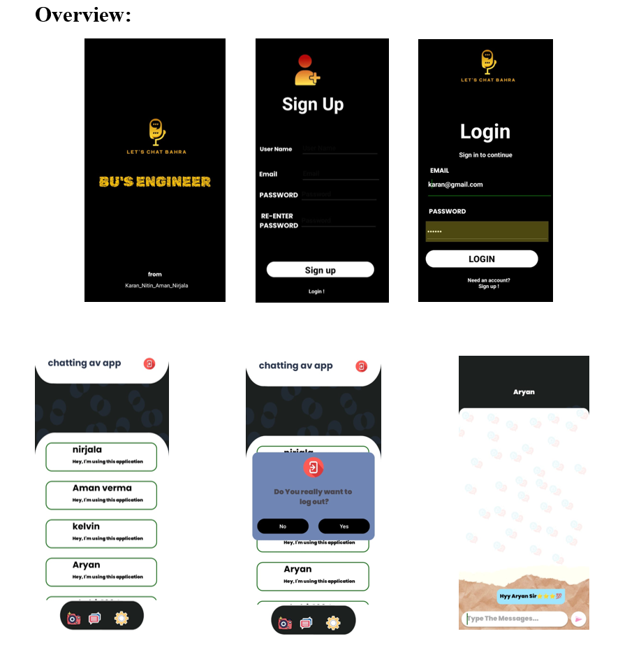

## 📸 Project Demo
🎥 **Demo Video:**  
[](https://youtu.be/c0OkFGF2S2E?si=A7APE1qXZrV6po7w)



---

## ✨ Features

- 🚀 Splash Screen
- 🔐 Login & Signup using Firebase Authentication
- 👥 View all registered users
- 💬 Real-time one-to-one messaging
- 📩 Firebase Realtime Database for storing messages
- 🔁 Logout Button to sign out
- 🎨 Clean and responsive UI with XML layouts
- ☁️ Cloud backend powered by Firebase

---

## 🛠️ Tools & Tech Stack

- Java (Backend logic)
- XML (UI Design)
- Firebase Authentication
- Firebase Realtime Database
- Android Studio

---

## 📦 How to Run the Project

1. Clone this repository:
   ```bash
   git clone https://github.com/kbhatia2005/Simple-Chat-Application.git
